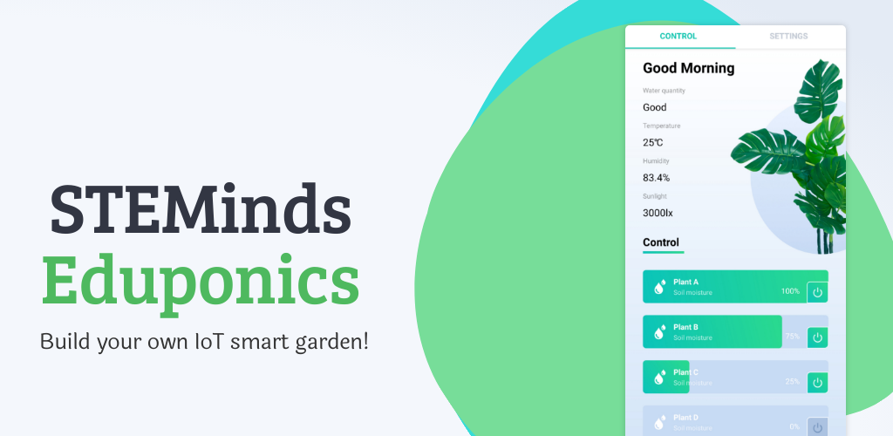
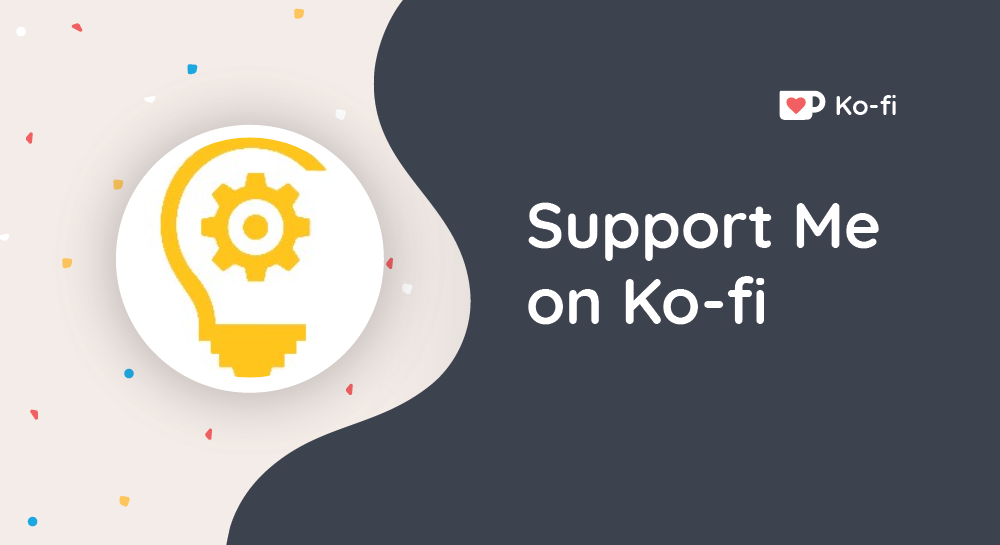

# Eduponics-Pi-MQTT

Python3 MQTT package for the Eduponics Mobile app

## Usage instructions

## Pre-requirements

You'll need:

- Raspberry Pi (any version will work)
- Soil moisture sensors (the software has no limit, you can connect as many as you want)
- Temperature and humidity sensor (DHT family will work)
- Water quantity sensor (any sensor to measure quantity of the water)
- Pump
- Valve if you control multiple plants

You don't have to have all those sensors, you can modify your code to support only 1 soil moisture sensors or everything.

## Installation

clone this repository with git clone to your Raspberry pi and run:

```
sudo python3 setup.py install
```

For now, this library been tested only on Raspberry Pi (Zero and 2,3,4)

## Example code

Please look into /examples folder to find a working example code to communicate with the app..
the code needs to be modified to connect to your open source hardware.

### Package functions

The package includes multiple functions

Function name | Description | Example
------------ | ------------- | -------------
Init | Initialize the MQTT Object | MQTT = mqtt.MQTT(addressportts=on_message_callback)
get_uuid() | Generate unique UUID and QR code | the library does it automatically
update_multiple_soil_sensors() | update multiple sensors at once | MQTT.update_multiple_soil_sensors(sensors)
update_single_soil_sensor()| update single soil moisture sensor | MQTT.update_single_soil_sensor(sensor)
update_environmental_data() | update environmental sensors data | update_environmental_data(env_data)

Example of single sensor dictionary:

```
sensor = {
    "id":0,
    "name":"Plant A",
    "enabled":1,
    "moisture":"100%"
}
```
Example of multiple sensors dictionary:
```
sensors = [{
    "id":0,
    "name":"Plant A",
    "enabled":1,
    "moisture":"100%"
},{
    "id":1,
    "name":"Plant B",
    "enabled":1,
    "moisture":"75%"
},{
    "id":2,
    "name":"Plant C",
    "enabled":1,
    "moisture":"25%"
},{
    "id":3,
    "name":"Plant D",
    "enabled":0,
    "moisture":"0%"
}]
```
Example of environmental data dictionary:
```
environment_data = {
    "temp":25.0,
    "humidity":83.4,
    "sunlight":3000.0,
    "water_quantity":"Good"
}
```
## About us

We are STEMinds, a tiny startup based in Shenzhen, China.

Our mission is to design cutting edge hardware kits to teach the skills of the future.

We work hard to develop subject based kits to teach hands-on STEM subjects with ease.

Our mission is to teach at the best way, at the lowest price and at the fastest way possible, anyone, anywhere in the world.

## Support us

We work very hard to develop our custom hardware kits and still not a single one is available for purchase.

kits takes time, effort and money to develop. During such unprecedented times, it's difficult to get funded.

That doesn't stop us from giving back to the community and doing our best effort to get involved and create impact, even without earning a penny.
Support us by spreading the word and if you feel generous, you can buy us a coffee!



Feel free to treat us at [ko-fi.com/STEMinds](ko-fi.com/STEMinds) - for you it's 5$ for us it's to keep doing what we love the most.

## Special thanks

We would like to thank some special contributors to the entire STEMinds Eduponics mobile app project

### Translations

For our mobile app language translators

- STEMinds - Hebrew, English, Chinese

- Akshay Vernekar - Hindi

- Amanda Elnecave - Português

- David Motsch - German

- Lưu Đức Toàn - Vietnamese

### Play store featured design

For our features play store picture we would like to thank Hotpot Design
Feel free to visit them at hotpot.ai to get your own amazing designs at no time.

## Bug reporting

Feel free to report a bug through the app to our email at contact@steminds.com
It will be even better if you can repot us through github and we will follow us to fix it.
any contribution is welcome. we are looking to improve but not often have the time and resources to do it all.

## TODO List

- [x] Basic MQTT subscribe publish mechanism
- [x] QR code unique UUID generator and scanner in the APP
- [x] Support for unlimited amount of plants (ScrollView)
- [x] Multi language support (contact us if you want extra language to be added)
- [ ] Ability to change the language inside the APP without changing system language
- [ ] Change the MQTT broker to STEMinds dedicated secure and fast MQTT broker.
- [ ] Add APP notifications when actions need to be taken (watering, warning etc ...)
- [ ] Add hydroponics mode with: pH, EC, TDS, water temperature ...
- [ ] Add learning section with knowledge database of plants, veggies, herbs and how to grow them ...
- [ ] Simplify the python library
- [ ] Add support with circuit-python for ESP32 and other micro controllers
